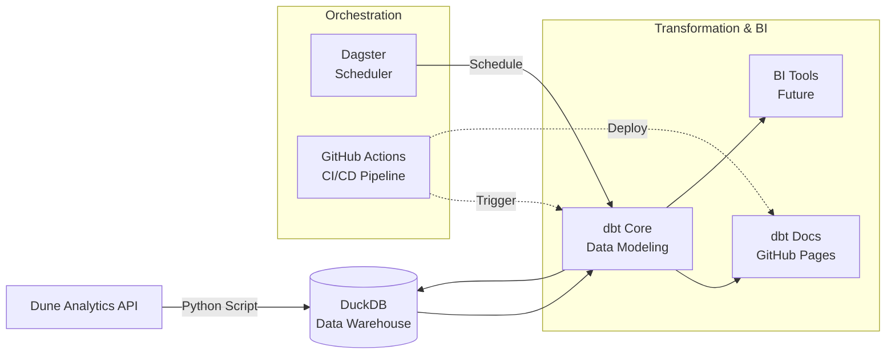

# Onchain Analytics

[](https://github.com/siobhan-doherty/onchain-analytics/actions/workflows/ci.yml)

A production-grade analytics pipeline for DEX trading data, built with Dune API, DuckDB, dbt & Dagster.

## Architecture



## Quick Start

### 1. Clone repository & Set Dune API key

```bash
git clone https://github.com/siobhan-doherty/onchain-analytics.git
cd onchain-analytics
export DUNE_API_KEY="your_dune_api_key"
```

### 2. Run pipeline with Docker
```bash
docker compose up --build
```
### 3. Launch Dagster UI
```bash
open http://localhost:3000
```

## Documentation

The dbt documentation site is automatically deployed to GitHub Pages and can be viewed [here](https://siobhan-doherty.github.io/onchain-analytics/).
