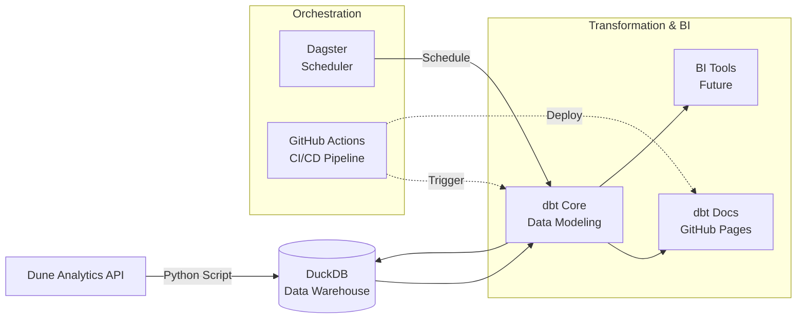

# Onchain Analytics

[](https://github.com/siobhan-doherty/onchain-analytics/actions/workflows/ci.yml)
[](https://siobhan-doherty.github.io/onchain-analytics/)
[](https://dagster.io/)
[](https://getdbt.com/)
[](https://opensource.org/licenses/MIT)

A production-grade analytics pipeline for DEX trading data, built with Dune API, DuckDB, dbt & Dagster.

## Architecture


## Quick Start

### 1. Clone repository & Set Dune API key

```bash
git clone https://github.com/siobhan-doherty/onchain-analytics.git
cd onchain-analytics
export DUNE_API_KEY="your_dune_api_key"
```

### 2. Run pipeline with Docker
```bash
docker compose up --build
```
### 3. Launch Dagster UI
```bash
open http://localhost:3000
```

## Project Structure
```bash
models/
├── staging/
│   └── stg_dex_trades.sql              # Light cleaning, casting, renaming
├── intermediate/
│   └── int_dex_daily_volume.sql        # Business logic, aggregations
└── marts/
    ├── core/
    │   ├── fct_dex_trades.sql          # Fact table: individual trades
    │   ├── dim_tokens.sql              # Dimension table: token metadata
    │   └── _core_models.yml            # Documentation & tests
    └── defi/
        ├── fct_dex_daily_metrics.sql   # Aggregated daily metrics
        └── _defi_models.yml            # Documentation & tests
```

## Documentation

The dbt documentation site is automatically deployed to GitHub Pages and can be viewed [here](https://siobhan-doherty.github.io/onchain-analytics/).

## Business Questions Answered

| Model | Key Business Questions |
|-------|------------------------|
| `fct_dex_daily_metrics` | What is the daily trading volume per blockchain & DEX? Which days had the highest activity? |
| `int_dex_daily_volume` | What is the average trade size and number of unique traders per day? |
| `fct_dex_trades` | What are the details of a specific trade given a transaction hash? |
| `dim_tokens` | Which tokens are most frequently traded? |

## Example SQL Query

```sql
-- Daily trading volume by blockchain and DEX (last 7 days)
SELECT
    trade_date,
    blockchain,
    project,
    total_volume_usd,
    number_of_trades,
    unique_traders
FROM main.fct_dex_daily_metrics
WHERE trade_date >= CURRENT_DATE - INTERVAL '7' DAY
ORDER BY trade_date DESC, total_volume_usd DESC
LIMIT 20;
